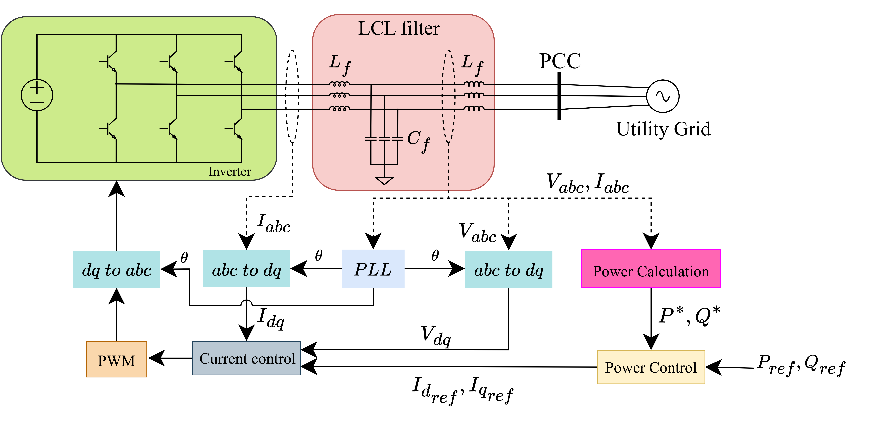

# Grid-Following Inverter (GFL): บทบาทสำคัญในการบูรณาการพลังงานหมุนเวียน  

---

## 1. ปัญหาก่อนการมาถึงของ Grid-Following Inverter  

ก่อนที่จะมีการพัฒนาอินเวอร์เตอร์ประเภท Grid-Following (GFL) ระบบไฟฟ้ากำลังพึ่งพาเครื่องจักรกลไฟฟ้าแบบดั้งเดิม เช่น **Synchronous Generator (SG)** เป็นตัวหลักในการผลิตพลังงานไฟฟ้า เครื่องกำเนิดเหล่านี้ไม่เพียงแต่สร้างกำลังไฟฟ้าเท่านั้น แต่ยังมีคุณสมบัติสำคัญคือสามารถ **กำหนดความถี่และแรงดันของระบบ** ได้โดยตรง ทำให้ระบบไฟฟ้ามีเสถียรภาพโดยธรรมชาติ  

แต่เมื่อโลกเริ่มหันมาใช้ **พลังงานหมุนเวียน (Renewable Energy)** อย่างโซลาร์เซลล์และกังหันลม ปัญหาหลักที่เกิดขึ้นคือ แหล่งพลังงานเหล่านี้ไม่สามารถเชื่อมต่อเข้ากับระบบไฟฟ้าได้โดยตรง เนื่องจากกำลังไฟฟ้าที่ผลิตออกมามีความผันผวน ขึ้นอยู่กับสภาพอากาศ แสงแดด และความเร็วลม  

อีกทั้งอุปกรณ์แปลงไฟที่จำเป็นคือ **Power Electronics (อินเวอร์เตอร์)** นั้น ไม่ได้มีคุณสมบัติ “สร้างความถี่และแรงดัน” ได้เหมือน synchronous machine อินเวอร์เตอร์เพียงอย่างเดียวจึงไม่สามารถกำหนดจังหวะ (synchronization) ของระบบได้ หากไม่มีกริดหลักอยู่ก่อนแล้ว  

ดังนั้น หากต้องการให้โซลาร์ฟาร์มหรือวินด์ฟาร์มสามารถส่งไฟฟ้าเข้าสู่ระบบได้อย่างราบรื่น จึงจำเป็นต้องมี **กลไกควบคุมที่ทำให้อินเวอร์เตอร์สามารถ “ตาม” กริดที่มีอยู่** ได้อย่างถูกต้อง และนี่คือที่มาของ **Grid-Following Inverter (GFL)**  

---

## 2. Grid-Following Inverter คืออะไร?  

**Grid-Following Inverter (GFL)** คืออินเวอร์เตอร์ที่ออกแบบมาเพื่อทำงานในลักษณะ “ตาม” สัญญาณของระบบไฟฟ้าที่มีอยู่ กล่าวคือ อินเวอร์เตอร์ประเภทนี้ **ไม่สามารถกำหนดความถี่หรือแรงดันของระบบได้ด้วยตนเอง** แต่จะอ้างอิงแรงดันและความถี่จากกริดที่เชื่อมต่ออยู่  

คุณลักษณะหลักของ GFL ได้แก่:  

- **ต้องมีกริดอยู่ก่อน**: อินเวอร์เตอร์จะไม่สามารถทำงานได้ หากไม่มีแรงดันอ้างอิงจากกริด  
- **ทำงานเหมือน Current Source**: จะควบคุมกระแสที่จ่ายเข้าสู่กริด แทนที่จะกำหนดแรงดันโดยตรง  
- **เหมาะกับระบบที่ยังคงมี synchronous generator หรือ Grid-Forming device อยู่** เพราะอินเวอร์เตอร์เพียงอย่างเดียวไม่สามารถกำหนดจังหวะการทำงานของระบบได้  
- **ใช้กันแพร่หลาย**: อินเวอร์เตอร์สำหรับโซลาร์รูฟท็อป โซลาร์ฟาร์ม หรือวินด์ฟาร์ม ส่วนใหญ่เป็น GFL เนื่องจากมีต้นทุนต่ำและโครงสร้างควบคุมที่เข้าใจง่าย  

กล่าวโดยสรุป GFL ทำหน้าที่ **แปลงพลังงาน DC → AC** และ **ส่งพลังงานเข้าสู่กริดในลักษณะที่ซิงโครไนซ์กับกริดที่มีอยู่แล้ว**  

---

## 3. หลักการควบคุมของ GFL  

หลักการทำงานของ Grid-Following Inverter มักอธิบายผ่านโครงสร้างการควบคุม (control structure) ที่แบ่งออกเป็น 3 ชั้นหลัก ๆ ดังนี้:  

1. **การตรวจจับเฟสด้วย Phase-Locked Loop (PLL)**  
   - PLL มีหน้าที่ตรวจจับมุมเฟสและความถี่ของแรงดันกริดแบบเรียลไทม์  
   - ทำให้มั่นใจว่าอินเวอร์เตอร์จะจ่ายไฟออกมาในเฟสเดียวกับแรงดันของกริด  
   - หากไม่มี PLL อินเวอร์เตอร์อาจฉีดกำลังไฟฟ้าในเฟสที่ผิดพลาด ทำให้เกิดการสั่นหรือการปฏิเสธการเชื่อมต่อ  

2. **วงจรควบคุมกำลัง (Outer Control Loop)**  
   - อินเวอร์เตอร์ GFL มักควบคุมกำลังจริง (P) และกำลังรีแอกทีฟ (Q)  
   - ผู้ควบคุมสามารถกำหนดค่าการส่งออก เช่น ต้องการจ่ายพลังงานจริงสูงสุด (จากแสงอาทิตย์) และรักษา Q = 0 หรือใช้ Q เพื่อสนับสนุนแรงดันในระบบ  

3. **วงจรควบคุมกระแส (Inner Control Loop)**  
   - กระแสถูกแปลงไปอยู่ในแกน d–q (synchronous reference frame) เพื่อความสะดวกในการควบคุม  
   - แกน d มักใช้ควบคุมกำลังจริง (P)  
   - แกน q มักใช้ควบคุมกำลังรีแอกทีฟ (Q)  
   - หลังจากนั้นจึงถูกส่งต่อไปยังวงจร PWM เพื่อสร้างสัญญาณควบคุมสวิตช์ของอินเวอร์เตอร์  

กล่าวโดยรวม **ลำดับการควบคุมคือ**: PLL → Outer Loop (P/Q) → Inner Current Loop → PWM  

---

## 4. ปัญหาที่ GFL สามารถแก้ไขได้  

Grid-Following Inverter แม้จะไม่สามารถสร้างแรงดันและความถี่เองได้ แต่ก็มีบทบาทสำคัญในการบูรณาการพลังงานหมุนเวียนและแก้ปัญหาหลายด้าน ได้แก่:  

- **การเชื่อมต่อแหล่งพลังงานหมุนเวียนกับกริดที่มีอยู่**  
  ทำให้โซลาร์ฟาร์มและวินด์ฟาร์มสามารถป้อนพลังงานเข้าสู่ระบบไฟฟ้าโดยไม่รบกวนเสถียรภาพของระบบ  

- **การควบคุมกำลังไฟฟ้าแบบยืดหยุ่น**  
  สามารถกำหนดได้ว่าจะส่ง P เท่าใดเพื่อผลิตพลังงานเข้าสู่ระบบ และปรับ Q เพื่อช่วยควบคุมแรงดันในระบบได้  

- **การสนับสนุนเสถียรภาพของกริด**  
  เช่น ปรับ Power Factor, ลดความเพี้ยนของแรงดัน (voltage distortion) และรองรับการเปลี่ยนแปลงโหลดอย่างฉับพลัน  

- **ต้นทุนต่ำและมีเทคโนโลยีที่พัฒนาแล้ว**  
  จึงเป็นโซลูชันที่ใช้ได้ทันทีในปัจจุบัน ไม่ต้องลงทุนโครงสร้างใหม่มากนัก  

---

## 5. บทสรุป  

**Grid-Following Inverter (GFL)** คือหนึ่งในนวัตกรรมหลักที่ทำให้การบูรณาการพลังงานหมุนเวียนเข้าสู่ระบบไฟฟ้ากลายเป็นจริง อินเวอร์เตอร์ชนิดนี้ไม่สามารถสร้างความถี่และแรงดันเองได้ แต่ทำงานโดย “ติดตาม” กริดที่มีอยู่ ผ่านกลไกการควบคุมที่อาศัย PLL และการควบคุมกระแสในแกน d–q  

แม้จะมีข้อจำกัด แต่ GFL ก็เป็นเทคโนโลยีที่เหมาะสมกับระบบที่ยังมี synchronous machine ทำหน้าที่หลักอยู่ และช่วยให้พลังงานหมุนเวียนสามารถจ่ายเข้าสู่ระบบได้อย่างเสถียรและยืดหยุ่น จึงนับว่าเป็นรากฐานสำคัญของระบบไฟฟ้ายุคพลังงานสะอาดในปัจจุบัน  
